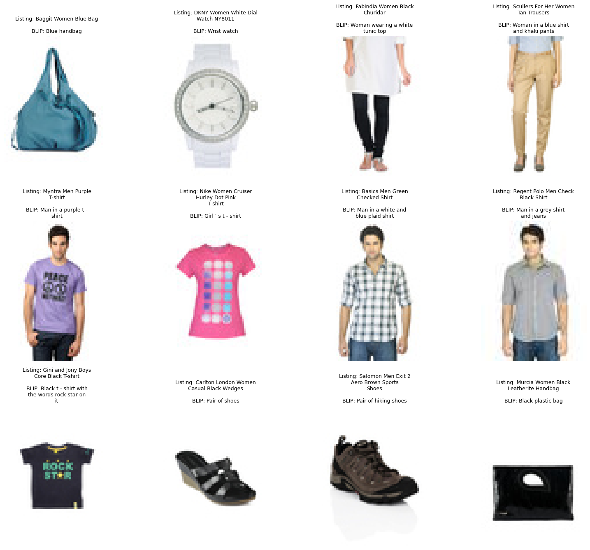
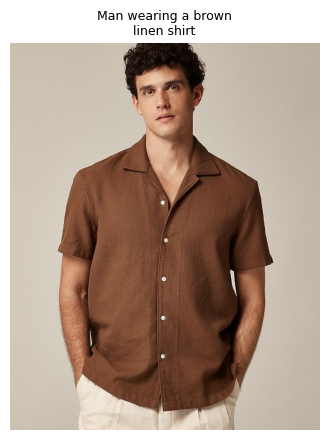

# BLIP Product Image Captioning

Adapting pretrained Salesforce BLIP to generate e-commerce-style product captions from images — no fine-tuning required.

## Tech Stack

- Hugging Face Transformers & Datasets
- PyTorch
- Pillow (PIL)
- Salesforce BLIP (`blip-image-captioning-base`)
- Hugging Face Hub (data + result export)

## Overview

This project takes a pretrained BLIP captioning model and steers its output toward e-commerce product copy purely through **prompt conditioning** — no weight updates, no training loop. Fine-tuning a vision-language model is expensive and dataset-specific; prompt conditioning gets a usable stylistic shift for free, making it a practical first move before investing in a fine-tuning pass.

## Pipeline

1. Load a public product-image dataset from the Hugging Face Hub
2. Load pretrained BLIP (`Salesforce/blip-image-captioning-base`)
3. Run zero-shot captioning on sample product images
4. Steer outputs toward e-commerce style via prompt conditioning
5. Clean up raw captions in post-processing
6. Visualize results against real listing titles
7. Evaluate caption quality with ROUGE
8. Test on outside images to confirm generalization
9. Export and push results to the Hugging Face Hub

## Results

### Zero-shot captions vs. real listing titles

*Zero-shot BLIP captions vs. real listing titles across a random sample — generated with no fine-tuning.*

### Generalization beyond the training distribution

*Test on an image outside the training distribution, confirming the pipeline generalizes.*

## A Note on ROUGE Scores

ROUGE scores in this project are low by design, and that's expected rather than a flaw. Zero-shot BLIP captions describe what's *visible* in the image (color, garment type, pose), while real listing titles often include brand names and SKU details that have no visual signal to learn from. Low text overlap here reflects a ceiling inherent to this approach, not a failure of the pipeline.

## Setup & Usage

1. Open `BLIP_Product_Image_Captioning.ipynb` in [Google Colab](https://colab.research.google.com/).
2. Run all cells top to bottom — dependencies install automatically in the first cell.
3. A GPU runtime is recommended (`Runtime > Change runtime type > GPU`) for faster inference.
4. To test on your own images, use the upload cell in the notebook section covering outside-distribution testing.

## Next Steps

- Fine-tune BLIP on this dataset's listing titles to close the gap between visual description and product copy
- Swap in `blip-image-captioning-large` for richer captions
- Ship a live demo as a Hugging Face Space
